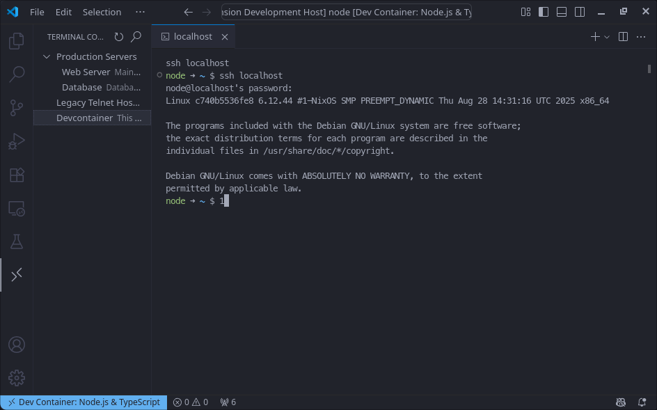
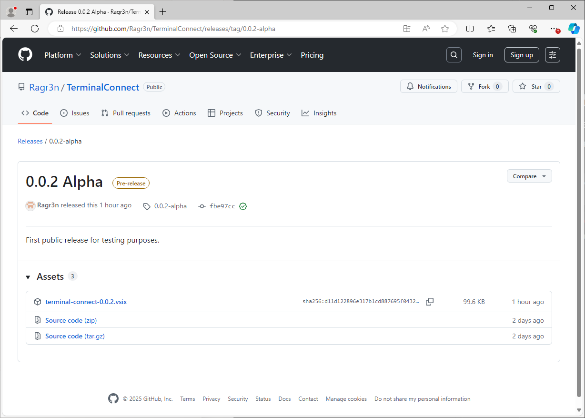
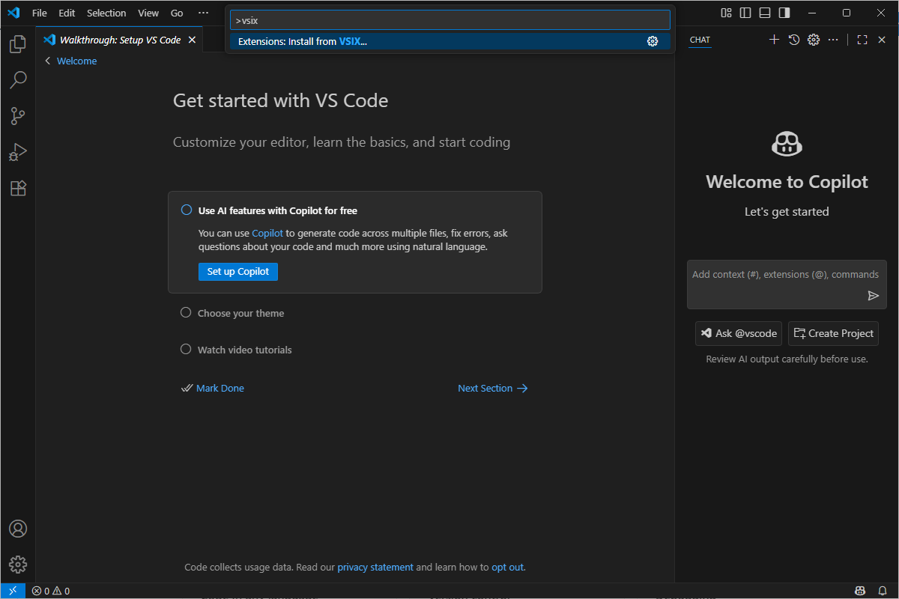
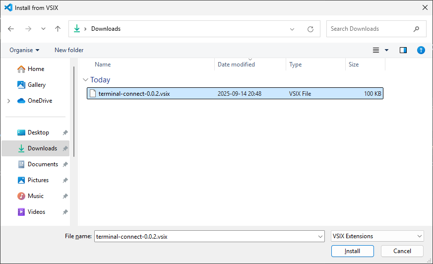
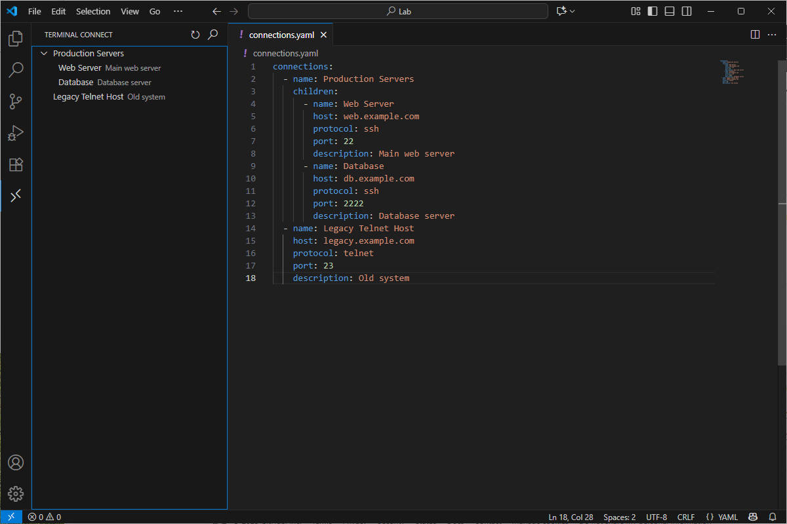

# Terminal Connect

Connect to remote hosts via SSH or Telnet directly from VS Code, using host definitions in a YAML file.

## Features

- **Tree View:** Browse and search hosts/groups in the Terminal Connect sidebar.
- **Connect Instantly:** Open a terminal to any host with a single click.
- **Custom Connection Strings:** Configure SSH/Telnet command formats.
- **YAML-Based Configuration:** Define hosts and groups in a simple `connections.yaml` file.
- **Search:** Quickly find hosts by name, host, or description.



## Getting Started

1. **Install the Extension:**  
    Download the latest .vsix from github.
    
    In VS Code press `CTRL+SHIFT+P`to bring up the command pallet and search for `Extensions: Install from VSIX`
    
    Browse for the downloaded .vsix file and press Install
    

2. **Create a `connections.yaml` file:**  
   Place this file in your workspace root. Example:
   ```yaml
   connections:
     - name: Production Servers
       children:
         - name: Web Server
           host: web.example.com
           protocol: ssh
           port: 22
           description: Main web server
         - name: Database
           host: db.example.com
           protocol: ssh
           port: 2222
           description: Database server
     - name: Legacy Telnet Host
       host: legacy.example.com
       protocol: telnet
       port: 23
       description: Old system
   ```
    
3. **Open the Sidebar:**  
   Click the "Terminal Connect" icon in the Activity Bar.

4. **Connect:**  
   Click any host to open a terminal session.

## Extension Settings

This extension contributes the following settings:

- `terminalConnect.sshConnectionString`:  
  Format string for SSH connections. Default: `ssh {host}`

- `terminalConnect.telnetConnectionString`:  
  Format string for Telnet connections. Default: `telnet {host}`

You can use `{host}` and `{port}` as placeholders.

## Requirements

- VS Code v1.103.0 or newer
- SSH/Telnet clients installed on your system

## Known Issues

## Release Notes

### 0.0.1

- Initial release: SSH/Telnet tree view, YAML config, search, custom connection strings.

### 0.0.2

- Updated search functionality with dynamic filtering and created release.

---

## Contributing

## License

MIT